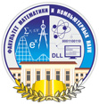

### Hi there 👋
### Добро пожаловать!
Меня зовут Марина. С начала 2020 года я - инженер по тестированию программного обеспечения.  

Немного обо мне

- 🔭 В настоящее время я являюсь manual QA engineer, работаю над сайтом [инвестиций Ак Барс Банка](https://invest.akbars.ru/)
- 🌱 Активно изучаю автотестирование и внедряю новые знания в рабочий проект. Планирую в ближайщее время стать Auto QA engineer
- 🔭 В Планах изучать язык программирования Python более углубленно. Для этого сейчас, параллельно с автотестированием, прохожу обучение и по Python
- 🤔 Интересуюсь также web-разработкой - имеется небольшой опыт в далёком прошлом. 
- 🌱 Через некоторое время планирую продолжить самообразование в сфере web-разработки, особенно в сторону React JS или в общем JS
- 📫 Как связаться со мной: [Telegram](https://t.me/Marina_T_S), [E-mail](marina01121992@mail.ru)
- ⚡ Fun fact: Котофил

<table width="100%" border='0'>
    <tr> 
        <td width="100px" valign="middle"></td>
        <td valign="middle">Дагестанский государственный университет Факультет математики и компьютерных наук. Специалитет Математик.</td>
    </tr>
    <tr>
        <td width="100px" valign="middle"></td>
        <td valign="middle">Дагестанский государственный университет Факультет математики и компьютерных наук. Магистратура Математика</td>
    </tr>
    <tr>
        <td width="100px" valign="middle"></td>
        <td valign="middle">Школа инженеров по автоматизации тестирования <a target="_blank" href="https://qa.guru">qa.guru</a>. 2023-2024 гг </td>
    </tr>
</table>
 
  
  

# Дипломный проект по автотестированию
Реализован во время обучения в Школе инженеров по автоматизации тестирования [qa.guru](https://qa.guru)  
## Тестирование UI
Тестовый проект [invest_akbars](https://github.com/temirkhanovams/invest_akbars)  

Использованные технологии:  

Реализованы UI-автотесты на проверку работы формы по открытию ИИС/БС, ПИФ, Доверительного управления  
Сайт: <a target="_blank" href="https://invest.akbars.ru/">invest.akbars.ru</a>

Что особенного:

- [x] Selene 
- [x] Степовой подход для описания Allure Step
- [x] Page Object
- [x] Параметризованная сборка
- [x] .env
- [x] Интеграция с Jira
- [x] Интеграция с Allure + AllureTestOps
- [x] Запуск тестов на стороне сервера Jenkins
- [x] Тестпланы авто- и ручного тестирования

## Тестирование REST API
Тестовый проект [invest_akbars](https://github.com/temirkhanovams/invest_akbars) 

## Тестирование мобильного приложения
Тестовый проект [invest_akbars](https://github.com/temirkhanovams/invest_akbars)   

- [x] Первоначальная формулировка шагов тесткейсов в Allure Testops и импорт их в IntelliJ Idea
- [x] Степовой подход для описания Allure Step
- [x] Различные файлы конфигураций для запуска тестов

## Первый учебный тестовый проект
Тестовый проект [qa_guru_jenkins_homework_12](https://github.com/temirkhanovams/qa_guru_jenkins_homework_12)  
Реализованы UI-автотесты на гитхаб и тестовый сайт DemoQA
Что особенного:

- [x] Степовой подход для описания Allure Step
- [x] Различные файлы конфигураций для запуска тестов
- [x] Page Object
- [x] Параметризованная сборка

[t.me/Marina_T_S](https://t.me/Marina_T_S">t.me/Marina_T_S)
